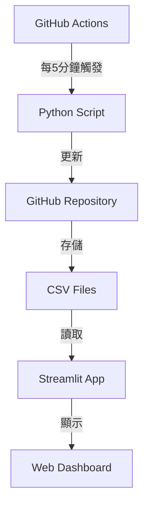

# LME Price Dashboard

一個免費且自動化的倫敦金屬交易所(LME)報價系統，包含即時報價顯示、歷史數據記錄和計算工具。

## 系統架構

## 功能需求

### 數據更新
- [ ] FX_rates (每5秒更新)
- [ ] LME_prices (每5秒更新)
- [ ] Westmetall_prices (每小時更新)
- [ ] USD_Spot_Rates (每小時更新)
- [ ] 早上8點和下午5點自動存檔所有分頁

### 看板功能
- [ ] 即時報價顯示
- [ ] 歷史數據查詢
- [ ] 計算工具
- [ ] 手機/電腦自適應界面

## 技術實現

### 1. GitHub Actions 自動化
- [ ] 設定 workflow 文件
- [ ] 配置定時觸發
- [ ] 錯誤通知機制

### 2. Python 腳本
- [ ] 數據抓取模組
- [ ] CSV 文件處理
- [ ] GitHub API 整合
- [ ] 錯誤處理機制

### 3. Streamlit 應用
- [ ] 基礎界面設計
- [ ] 數據展示組件
- [ ] 計算工具實現
- [ ] 自動刷新機制

## 項目進度

### 已完成
- [x] 系統架構設計
- [x] README 文件建立

### 進行中
- [ ] 待確認下一步實施項目

### 待完成
- [ ] GitHub Actions 配置
- [ ] Python 腳本開發
- [ ] Streamlit 應用開發
- [ ] 測試和優化

## 技術棧

- 版本控制：GitHub
- 自動化：GitHub Actions
- 後端：Python
- 前端：Streamlit
- 數據存儲：CSV on GitHub
- 部署：Streamlit Community Cloud

## 注意事項

1. 所有服務使用免費額度
2. 代碼和數據都將公開存儲
3. 需要定期檢查 GitHub Actions 使用額度
4. 建議設置錯誤通知機制

## 未來優化方向

1. 添加數據備份機制
2. 優化更新頻率
3. 增加數據分析功能
4. 改進用戶界面

## 貢獻指南

1. Fork 本專案
2. 創建新的功能分支
3. 提交更改
4. 發起 Pull Request

## 授權

MIT License