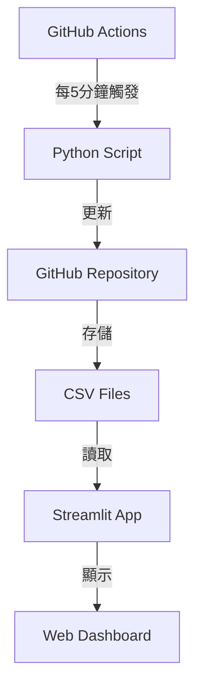

# LME Price Dashboard

一個免費且自動化的倫敦金屬交易所(LME)報價系統，包含即時報價顯示、歷史數據記錄和計算工具。

## 如何推送程式碼並自動更新網頁

1. **打開 Git Bash 或終端機**
2. **切換到專案資料夾**
   
   **Git Bash:**
   ```bash
   cd /d/ANACONDA/lme-dashboard
   ```
   
   **PowerShell:**
   ```powershell
   cd D:\ANACONDA\lme-dashboard
   ```
   
   **Anaconda Prompt:**
   ```cmd
   cd /d D:\ANACONDA\lme-dashboard
   ```
3. **檢查目前狀態**
   ```bash
   git status
   ```
4. **加入你修改的檔案**
   ```bash
   git add .
   # 或只加特定檔案
   # git add pages/2_前日收盤.py
   ```
5. **提交(commit)更改**
   ```bash
   git commit -m "說明你的修改內容"
   ```
6. **推送(push)到 GitHub**
   ```bash
   git push
   ```
   > 第一次 push 會要求你登入 GitHub（用瀏覽器或 token）。

7. **Streamlit Cloud 會自動偵測到 GitHub 有新 commit，幾分鐘內自動重新部署你的網頁。**

---

## 系統架構



## 功能需求

### 數據更新
- [ ] FX_rates (每5秒更新)
- [ ] LME_prices (每5秒更新)
- [ ] Westmetall_prices (每小時更新)
- [ ] USD_Spot_Rates (每小時更新)
- [ ] 早上8點和下午5點自動存檔所有分頁

### 看板功能
- [ ] 即時報價顯示
- [ ] 歷史數據查詢
- [ ] 計算工具
- [ ] 手機/電腦自適應界面

## 技術實現

### 1. GitHub Actions 自動化
- [ ] 設定 workflow 文件
- [ ] 配置定時觸發
- [ ] 錯誤通知機制

### 2. Python 腳本
- [ ] 數據抓取模組
- [ ] CSV 文件處理
- [ ] GitHub API 整合
- [ ] 錯誤處理機制

### 3. Streamlit 應用
- [ ] 基礎界面設計
- [ ] 數據展示組件
- [ ] 計算工具實現
- [ ] 自動刷新機制

## 項目進度

### 已完成 ✅
- [x] 系統架構設計
- [x] README 文件建立
- [x] Streamlit 應用開發
- [x] 認證系統實現
- [x] 即時數據抓取
- [x] 計算工具開發
- [x] 數據分析功能
- [x] 系統設定功能
- [x] 使用說明文檔
- [x] 測試腳本開發

### 進行中 🔄
- [ ] 用戶反饋收集
- [ ] 性能優化

### 待完成 📋
- [ ] GitHub Actions 自動化部署
- [ ] 更多數據來源整合
- [ ] 移動端優化
- [ ] 高級分析功能

## 技術棧

- 版本控制：GitHub
- 自動化：GitHub Actions
- 後端：Python
- 前端：Streamlit
- 數據存儲：CSV on GitHub
- 部署：Streamlit Community Cloud

## 注意事項

1. 所有服務使用免費額度
2. 代碼和數據都將公開存儲
3. 需要定期檢查 GitHub Actions 使用額度
4. 建議設置錯誤通知機制

## 未來優化方向

1. 添加數據備份機制
2. 優化更新頻率
3. 增加數據分析功能
4. 改進用戶界面

## 貢獻指南

1. Fork 本專案
2. 創建新的功能分支
3. 提交更改
4. 發起 Pull Request

## 🚀 快速開始

### 1. 環境準備
```bash
# 克隆專案
git clone <your-repo-url>
cd lme-dashboard

# 安裝依賴套件
pip install -r requirements.txt
```

### 2. 系統測試
```bash
# 運行完整功能測試
python test_all_functions.py
```

### 3. 啟動應用程式
```bash
# 啟動主應用程式
streamlit run app.py

# 或直接測試特定功能
streamlit run pages/1_LME_即時報價看板.py
streamlit run pages/2_前日收盤.py
streamlit run pages/3_線上計算機.py
streamlit run pages/4_數據分析.py
streamlit run pages/5_系統設定.py
streamlit run pages/6_使用說明.py
```

### 4. 首次使用
- **預設密碼**: `password`
- **建議**: 首次登入後立即更改密碼
- **功能**: 所有頁面都支援即時數據更新

## 🧪 測試新版本功能

### 測試步驟
1. **切換到專案目錄**
   ```powershell
   cd D:\ANACONDA\lme-dashboard
   ```

2. **安裝必要套件**
   ```bash
   pip install -r requirements.txt
   ```

3. **運行系統測試**
   ```bash
   # 快速測試 (推薦日常使用)
   python quick_test.py
   
   # 全面測試 (完整檢查)
   python test_all_functions.py
   ```

4. **測試各功能頁面**
   ```bash
   # 測試主應用程式
   streamlit run app.py
   
   # 測試LME即時報價看板
   streamlit run pages/1_LME_即時報價看板.py
   
   # 測試前日收盤
   streamlit run pages/2_前日收盤.py
   
   # 測試線上計算機（新功能）
   streamlit run pages/3_線上計算機.py
   
   # 測試數據分析（新功能）
   streamlit run pages/4_數據分析.py
   
   # 測試系統設定（新功能）
   streamlit run pages/5_系統設定.py
   
   # 查看使用說明
   streamlit run pages/6_使用說明.py
   ```

### 新功能說明
- **線上計算機**: 支援成分計算、LME係數計算、現價計算等功能
- **LME即時報價看板**: 即時顯示LME金屬價格
- **前日收盤**: 歷史數據查詢

### 常見問題
- 如果遇到 `ModuleNotFoundError: No module named 'streamlit_autorefresh'`，請執行：
  ```bash
  pip install streamlit-autorefresh
  ```
- 如果PowerShell無法識別 `streamlit` 命令，請使用：
  ```bash
  python -m streamlit run app.py
  ```

## 授權

MIT License

## 本地與雲端部署說明

### 本地開發流程
1. 啟動終端機（Anaconda Prompt、Git Bash 或 PowerShell）
2. 切換到專案資料夾
   
   **Git Bash:**
   ```bash
   cd /d/ANACONDA/lme-dashboard
   ```
   
   **PowerShell:**
   ```powershell
   cd D:\ANACONDA\lme-dashboard
   ```
   
   **Anaconda Prompt:**
   ```cmd
   cd /d D:\ANACONDA\lme-dashboard
   ```
3. 啟動 Streamlit
   ```bash
   streamlit run pages/2_前日收盤.py
   ```
   
   **測試新版本功能：**
   ```bash
   # 測試線上計算機
   streamlit run pages/3_線上計算機.py
   
   # 測試LME即時報價看板
   streamlit run pages/1_LME_即時報價看板.py
   ```
4. 程式會自動即時爬取 Westmetall（LME 價格）與台銀（匯率）資料，並快取於 `data/` 目錄下的 CSV 檔案。
5. 歷史資料會自動儲存於 `data/csp_history.csv`。

### 雲端部署（Streamlit Cloud）
- 推送程式碼到 GitHub 後，Streamlit Cloud 會自動重新部署 dashboard。
- 雲端程式僅能存取 repo 內的 `data/` 目錄，**無法存取本地 Z 槽或 D 槽的檔案**。
- dashboard 會自動即時爬取網路資料，或讀取快取於 `data/` 目錄的 CSV。
- 若需讓雲端 dashboard 顯示特定資料，請將必要的 CSV 一併 push 到 GitHub。

### 典型使用流程
1. 本地開發、測試
2. push 程式碼（與必要資料）到 GitHub
3. Streamlit Cloud 自動部署
4. dashboard 自動爬取網路資料，或讀取 repo 內的 `data/` CSV
